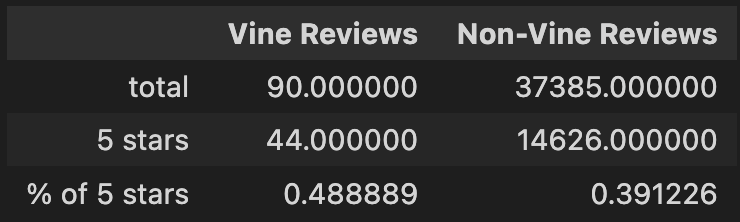
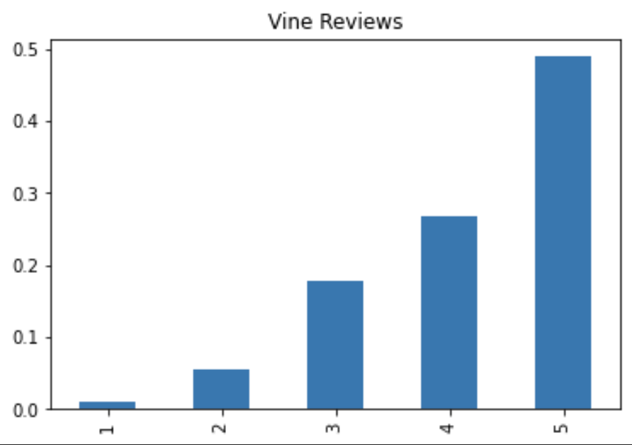
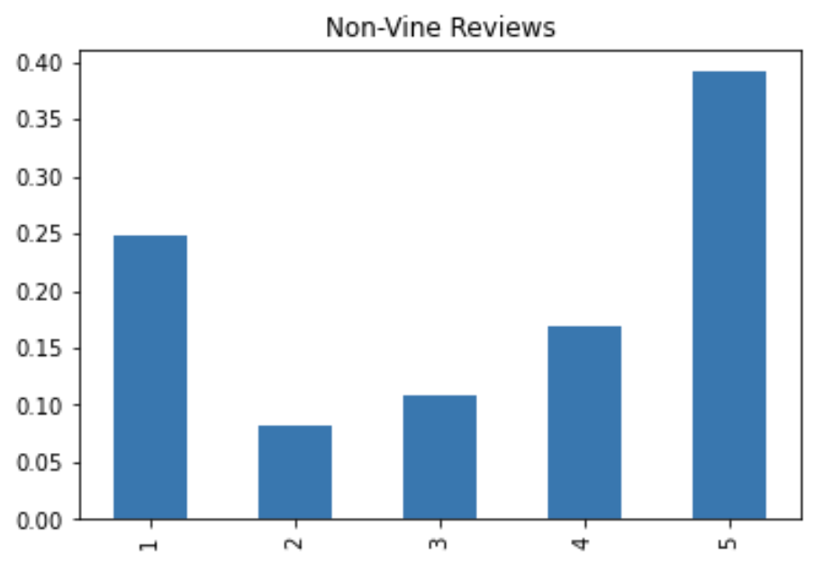

# Amazon Vine Anlaysis

## Overview

The purpose of this project is to utilize PySpark, AWS, and PostgreSQL to manage and analyze big data. We, as a part of an imaginary company BigMarket, are tasked with helping one of its clients analyze a large of set product reviews, so that the client can release their catalogue of products informatively.

## Results

On analyzing the video game reviews, we've found the following metrics:

* How many Vine reviews and non-Vine reviews were there?
* * There were 90 Vine reviews and, 
* * There were 37,385 non-Vine reviews 

* How many Vine reviews were 5 stars? How many non-Vine reviews were 5 stars?
* * There were 44 5-star Vine reviews and, 
* * There were 14,626 5-star non-Vine reviews

* What percentage of Vine reviews were 5 stars? What percentage of non-Vine reviews were 5 stars?
* * 48.89% of Vine reviews were 5-star reviews and, 
* * 39.12% of non-Vine reviews were 5-star reviews

    

## Summary

Although, what we do notice is that there are indicatiosn of a positivity bias.

As you can see in this spread of Vine reviews:

    

And also in this spread of non-Vine reviews:

    

With the exception of the relatively high 1-star non-vine reviews, both charts show the users' inclination to review the product positively. 

However, this too is simply an inclination. We cannot rely on only this much data to deduce whether the products being reviewed are actually deserving of the positivity or if there exists a bias. What might be worthwhile is to look at the customer ID to see how many customers are reviewing per a given review ID to gain an in-depth insight into the population inclination. The above analysis can be done by merging the review_id_table with the vine_table.